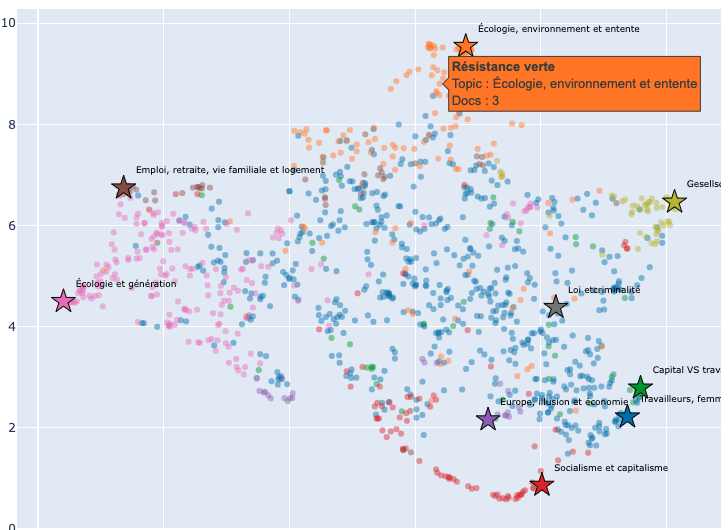

# Projet NLP ENSAE

Projet de Topic Modelling sur de corpus des professions de foi des élections législatives françaises (1973–1993), à partir du corpus [Archelec](https://gitlab.teklia.com/ckermorvant/arkindex_archelec).

## Objectif

Identifier les grands thèmes abordés par les candidats et comparer les positionnements thématiques entre partis politiques.

## Données

- **Source** : corpus [Archelec](https://gitlab.teklia.com/ckermorvant/arkindex_archelec).
- **Métadonnées** : CSV  [archelec.sciencespo.fr/explorer](https://archelec.sciencespo.fr/explorer)
- **Années couvertes** : 1973, 1978, 1981, 1988, 1993

## Récupérer les données

```bash
# Cloner le corpus
git clone https://gitlab.teklia.com/ckermorvant/arkindex_archelec

# Dézipper les fichiers texte
cd arkindex_archelec && shopt -s globstar && for f in text_files/**/*.zip; do unzip -q -d "$(dirname "$f")" "$f"; done
cd -
```

## Modèles implémentés

| Modèle | Description |
|--------|-------------|
| **LDA** | Latent Dirichlet Allocation |
| **NMF** | Non-negative Matrix Factorization |
| **BERTopic** | (UMAP + HDBSCAN + paraphrase-multilingual-MiniLM-L12-v2) |

## Pipeline

1. **Chargement** (`data_loader.py`) — lecture des `.txt` et du CSV, jointure
2. **Prétraitement** (`preprocessing.py`) — lemmatisation spaCy, suppression des accents, stopwords personnalisés
3. **Modélisation** (`lda.py`, `nmf.py`, `bertopic_train.py`) — entraînement et visualisation des topics
4. **Analyse** (`party_analysis.py`) — profils thématiques par parti, PCA, similarité cosinus

Le notebook `main.ipynb` orchestre l'ensemble du pipeline.

## Installation

```bash
pip install -r requirements.txt
python -m spacy download fr_core_news_sm
```


## Résultats

### Résultat final

<p align="center">
  
</p>

> Les graphiques sont encore plus lisibles en version interactive. Les projections 2D et 3D finales sont disponibles en HTML dans `plot_inter/projection/`, inutile donc de relancer tout le code pour les consulter.
